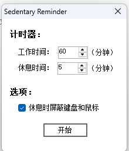
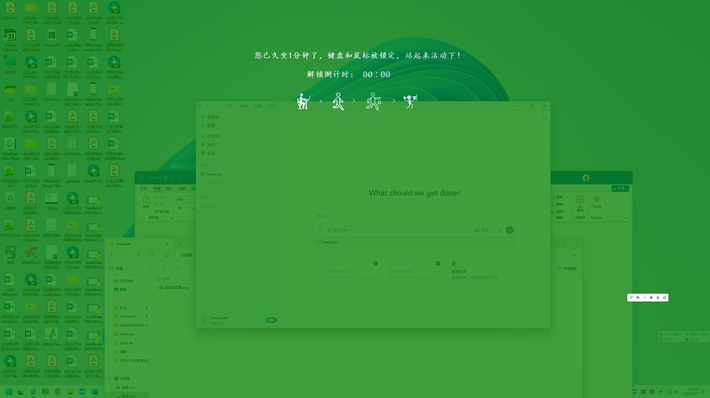

# MathGao Reminder

面向课堂使用的 Windows 提醒工具，可设置提醒时间、显示倒计时，并在到点后展示全屏提醒。

## 功能

- 设置提醒间隔和强制休息时长，默认每隔 35 分钟提醒、强制休息 0 秒
- 桌面悬浮状态与倒计时
- 悬浮窗右键勾选“锁定位置”，取消勾选即可重新拖动；位置和锁定状态在重启后自动恢复
- 到点全屏提醒
- 托盘运行与主窗口快速恢复
- 单实例运行，重复启动时唤醒已打开的窗口

## 运行环境

- Windows 10/11
- .NET 8 Desktop Runtime

## 下载运行

从 [GitHub Releases](https://github.com/erniaodoudoufei/mathgao-reminder/releases/latest) 下载 `MathGaoReminder-win11.zip`，解压后运行 `MathGao Reminder.exe`。

此发布包适用于 Windows x64，需要安装 .NET 8 Desktop Runtime。

## 本地运行

```powershell
dotnet run
```

## 构建

```powershell
dotnet build
dotnet publish -c Release -r win-x64 --self-contained false
```

## 回归检查

```powershell
dotnet run --project Tests/FloatingWindowTests.csproj -c Release
```

## 界面预览





